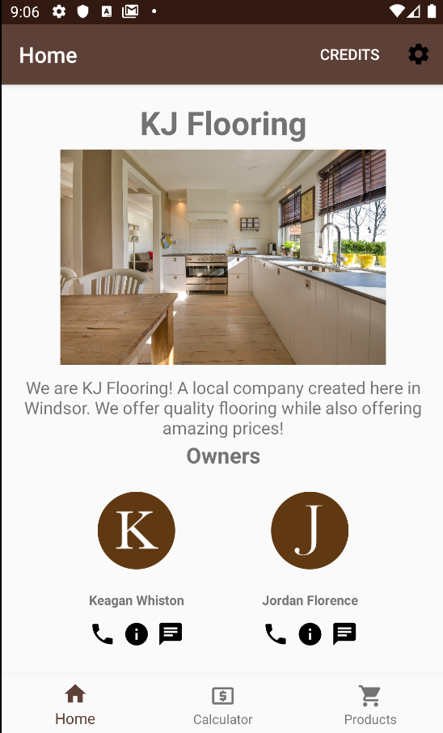
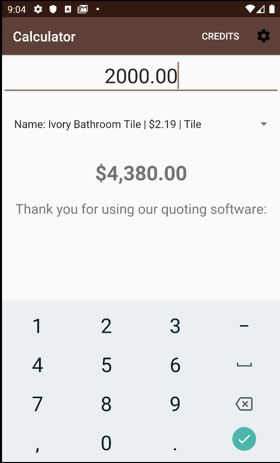
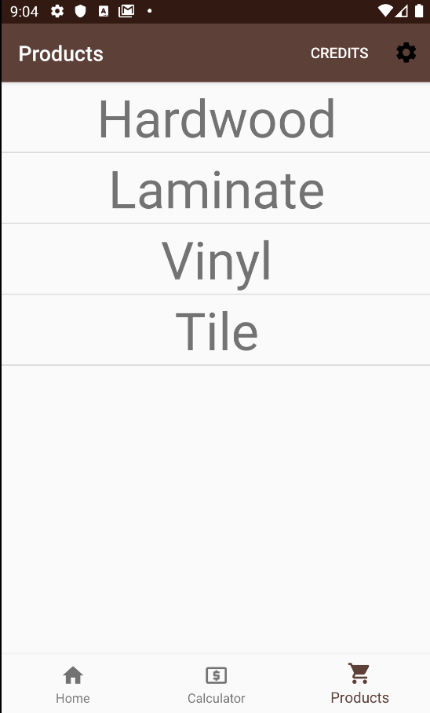
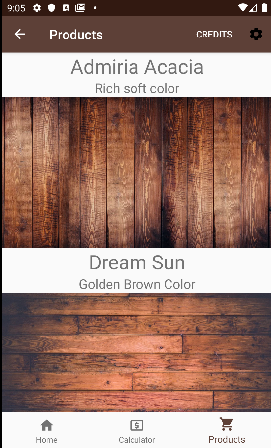
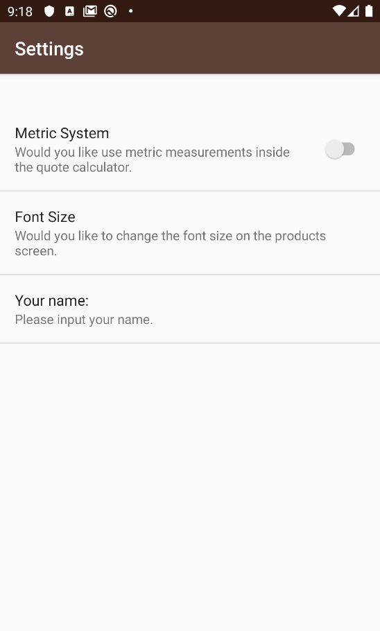

# KJFlooring
Android Application to quote Flooring Cost

The purpose of this application was to create an app that would function for a small business of varying size and offer a reason for why users would download it.  The "hook" in our application is a calculator that provides users with a quote based on their square footage and our products.  All images are free to use from pixabay 

## What is KJFlooring
KJFlooring is the name of our fictious flooring company that was created to satisfy the requirements of the project.  We also have a twitter page for our company which can be found [here](https://twitter.com/flooringkj).

## Photos of the Application

## Home Screen
The home screen of the application.

 

## Calculator
The quoting calculator of our application, where you can select a type of floor and calculate the quote, passing in the square footage.

## Products 
The products we have to offer with a sub screen that leads to the specific flooring type.

 

## Settings
The settings we have available inside of the application.

## Acknowledgements
A very large thank you to Câi Filiault, Nick Sylvestre and Darren Takaki

Stack Overflow

Pixabay
